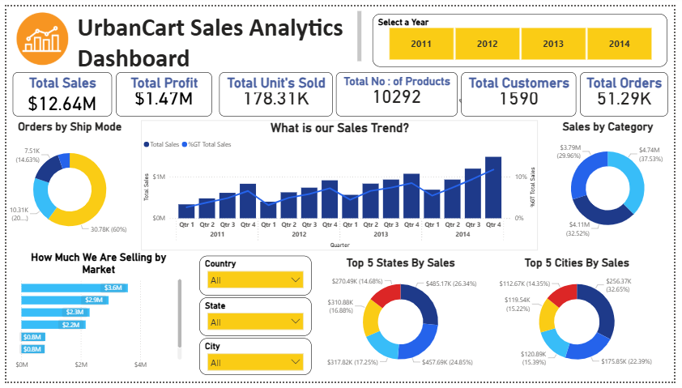

# UrbanCart_Sales_Analysis_Dashboard

This project presents a **Power BI dashboard** for UrbanCart’s sales analysis, offering insights into **sales, profit, units sold, customers, and orders**.  

## Features
- **Sales Trends (2011–2014):** Quarterly performance tracking.  
- **Orders by Ship Mode:** Distribution of orders across shipping methods.  
- **Category-wise Sales Contribution:** Revenue share by product categories.  
- **Market Analysis:** Comparative performance across markets.  
- **Top 5 States & Cities:** Geographic breakdown of sales.  
- **Interactive Filters:** Year, country, state, and city for dynamic exploration.  

## Key Insights
- Total Sales: **$12.64M**  
- Total Profit: **$1.47M**  
- Units Sold: **178K+**  
- Customers: **1,590**  
- Orders: **51K+**  

## Tools Used
- **Power BI** – Dashboard creation & visualization  
- **Power Query** – Data cleaning & transformation  
- **DAX** – Measures and calculations  

## Dashboard Preview

---

This dashboard enables **data-driven decisions** by highlighting business performance, profitability, and regional contributions, helping stakeholders track growth and identify opportunities effectively.
